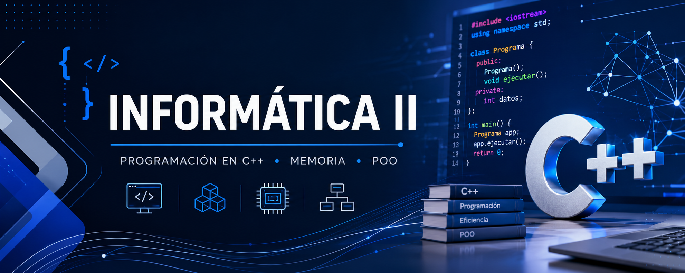

  

  <strong>
    Prácticas fundamentales para el desarrollo de programas en C++,
    con énfasis en el manejo eficiente de la memoria y la
    Programación Orientada a Objetos (POO).
  </strong>

## *Sobre el repositorio*

Este espacio reúne las prácticas, ejercicios y proyectos desarrollados
durante el curso de **Informática II**.

Cada actividad representa una oportunidad para comprender no solo cómo
escribir un programa, sino también cómo construir soluciones eficientes,
estructuradas y orientadas a resolver problemas reales.

El trabajo se centra especialmente en tres pilares:

- **Programación en C++**
- **Manejo eficiente de la memoria**
- **Programación Orientada a Objetos (POO)**

## *Contenido*

<table>
  <tr>
    <th>#</th>
    <th>Tipo</th>
    <th>Contenido</th>
  </tr>
  <tr>
    <td>0</td>
    <td>Prueba diagnóstica</td>
    <td><a href="./practicas/prueba-diagnostica/README.md">Prueba Diagnóstica</a></td>
  </tr>
  <tr>
    <td>1</td>
    <td>Práctica</td>
    <td><a href="./practicas/practica-no-1/README.md">Práctica No. 1</a></td>
  </tr>
</table>

## *Sobre mí*

**Andrea Arias Cantillo**
Ingeniería Electrónica

Me gusta aprender y desarrollar soluciones tecnológicas que puedan ir más
allá de la programación y tener una aplicación real. Me interesan
especialmente los proyectos con **impacto social** y aquellos que buscan
resolver necesidades o mejorar procesos en la **industria**.

Actualmente estoy fortaleciendo mis conocimientos en programación y
desarrollo de soluciones aplicadas a la ingeniería.

**Perfil profesional:** [LinkedIn](https://www.linkedin.com/in/andrea-arias-cantillo/)
